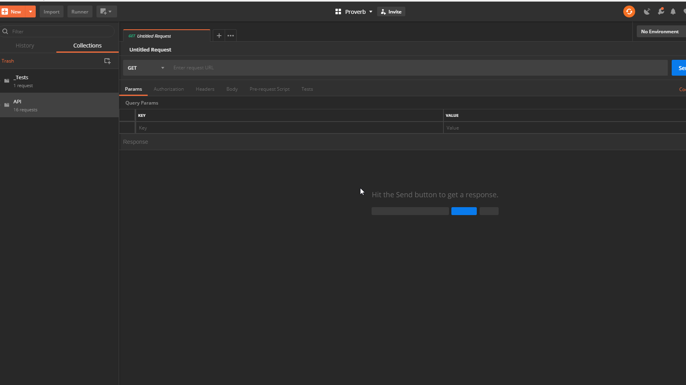

# Features
### Fast Response
### Responsive Design

# Technologies and Tools
Proverb is a Counseling Management application built on a variation of the MEAN stack: **MongoDB**, **Express**, **React**, and **Node**.
### RESTful API with Express
I used **Postman** to test my Express API and add initial data. Postman provides tools to create collections of requests and test scripts.

*Running a Postman Test suite to test a collection of API routes all at once.*

The structure of the Express backend immitates layered architecture for a loosely coupled design: my Express app routes requests to controller methods, which pass a callback through a business layer to my data layer, where the results of the asynchronous database query can be sent to the client. Here is an example process used to get a resource by its id:
> Snipit from server script.
```js 
const app = mainController.setup();

app.post('/api/resource/', resourceController.createResource);
app.get('/api/resource/:id', resourceController.getResource);
app.put('/api/resource/:id', resourceController.updateResource);
app.get('/api/resource', resourceController.searchResources);
```
> Snipit from Resource Controller
```js
  getResource(req, res) {
    const id = DataParser.getParamByName(req, 'id');

    // on success callback: send the data.
    const success = (result) => {
      dto.setSingleValueData(result);
      return res.send(dto.build());
    };

    // callback for fail (could not find a resource with the given id)
    const fail = () => {
      dto.setSingleValueData('Could not find a resource with that id!');
      dto.setDetails(settings.response.NOT_FOUND);
      return res.send(dto.build());
    };
    return manager.getById(id, success, fail);
  }
```
> Snipit from Resource Manager
```js
  getById(id, success, fail) {
    const handler = (err, data) => {
      if (err) {
        fail(err);
      } else {
        success(data);
      }
    };

    // The DAO will execute the query and pass the data to the callback functions defined in the Controller.
    return this.db.findById(this.model, id, handler);
  }
```
### Mongo Database
### React

# More content by Connor Low
I have been working on a tutorial for deploying Node.JS applications to Heroku. It includes some of the same technologies referenced here. [Click here to check it out](https://github.com/ConnorJamesLow/icc-heroku)!