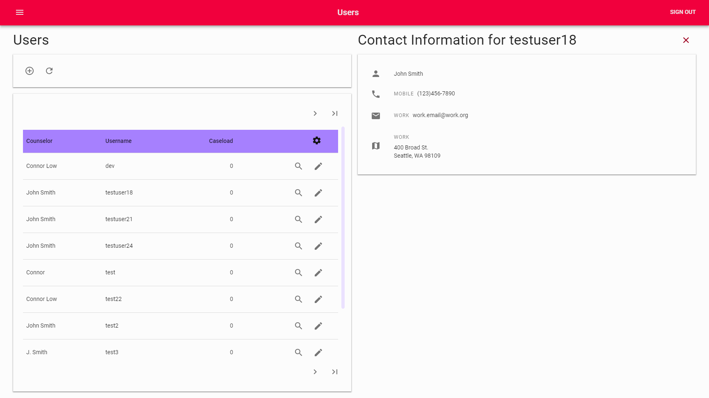

# Content
1. [Features](#Features)
2. [Technologies and Tools](#Technologies-and-Tools)
3. [More content by Connor Low](#More-content-by-Connor-Low)
# Features
*Proverb* is a Counseling Management web application designed to simplify workflow and increase organization.  


*A demo of the responsive grid and basic application workflow.*  

### Responsive Design
*Proverb* utilizes Material-UIs grid system to provide a consistent and responsive design. This allows for productivity on any device, or in combination with other applications sharing screen space. Scrollable sections allow for easy access to multiple features without excessive page scrolling.   
[*Top of Section*](#Features)  

### Simple Workflow 

*The basic application layout*  

*Proverb* makes resource management easy. Each resource group managed by the app is listed in the **App Navigation**. When one of these resources is selected (e.g. Users), the primary controls and data for that resource is loaded into the **Primary Content** section. From here, additional forms, lists, reports, and other secondary content related to the primary content may be loaded into the **Secondary Content** section. Each section has its own scrollable area so each may be managed independently. This way, the user can manage multiple resources at once without having to open multiple windows for reference.    
[*Top of Section*](#Features)  

# Technologies and Tools
[*Top of Page*](#Content)  
*Proverb* is built on a variation of the MEAN stack: **MongoDB**, **Express**, **React**, and **Node**.
### RESTful API with Express
I used **Postman** to test my Express API and add initial data. Postman provides tools to create collections of requests and test scripts.
  
*Running a Postman Test suite to test a collection of API routes all at once.*

The structure of the Express backend imitates layered architecture for a loosely coupled design: my Express app routes requests to controller methods, which pass a callback through a business layer to my data layer, where the results of the asynchronous database query can be sent to the client. Here is an example process used to get a resource by its id:
> Server script
```js 
const app = mainController.setup();

app.post('/api/resource/', resourceController.createResource);
app.get('/api/resource/:id', resourceController.getResource);
app.put('/api/resource/:id', resourceController.updateResource);
app.get('/api/resource', resourceController.searchResources);
```
> Resource Controller
```js
  getResource(req, res) {
    const id = DataParser.getParamByName(req, 'id');

    // on success callback: send the data.
    const success = (result) => {
      dto.setSingleValueData(result);
      return res.send(dto.build());
    };

    // callback for fail (could not find a resource with the given id)
    const fail = () => {
      dto.setSingleValueData('Could not find a resource with that id!');
      dto.setDetails(settings.response.NOT_FOUND);
      return res.send(dto.build());
    };
    return manager.getById(id, success, fail);
  }
```
> Resource Manager
```js
  getById(id, success, fail) {
    const handler = (err, data) => {
      if (err) {
        fail(err);
      } else {
        success(data);
      }
    };

    // The DAO will execute the query and pass the data to the callback functions defined in the Controller.
    return this.db.findById(this.model, id, handler);
  }
```
[*Top of Section*](#Technologies-and-Tools)  
### Mongo Database
In order to improve consistency of data structures, *Proverb* utilizes **Mongoose.js**. This adds some abstractions and utilities for accessing and modifying data. Schemas are used to define the strucutre of documents within a collection. Here is an example schema, used for the resource collection:
```js
const resource = new mongoose.Schema({
  name: {
    type: String,
    required: true
  },
  contentType: {
    type: String,
    default: 'Other'
  },
  topics: [String],
  content: {},
  meta: {
    author: String,
    datePublished: {
      type: String,
      default: Date.now
    },
    dateAdded: {
      type: String,
      default: Date.now
    },
  }
}, { collection: 'resource' });
```  
[*Top of Section*](#Technologies-and-Tools)  

### React
*Proverb* has an attractive and practical design, thanks to the Material-UI library, which was created for the React library.
[*Top of Section*](#Technologies-and-Tools)  

# More content by Connor Low
[*Top of Page*](#Content)  
I have been working on a tutorial for deploying Node.JS applications to Heroku. It includes some of the same technologies referenced here. [Click here to check it out](https://github.com/ConnorJamesLow/icc-heroku)!